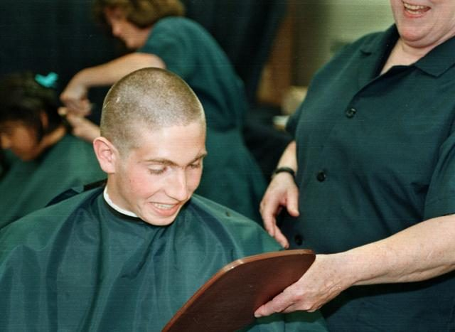
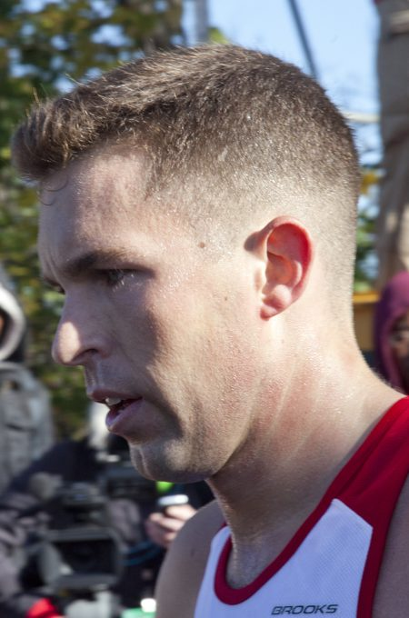
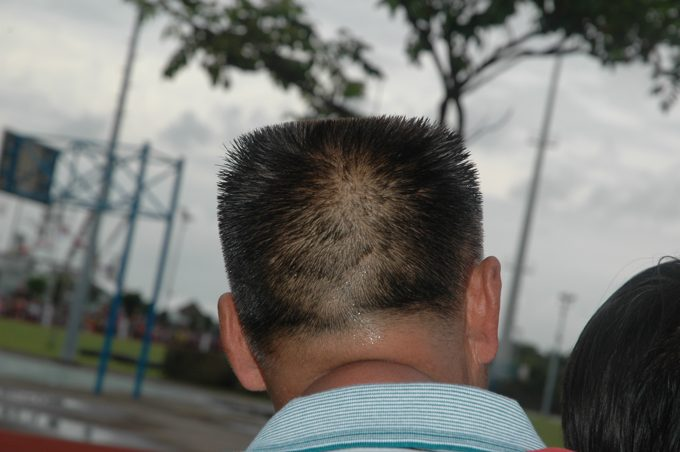
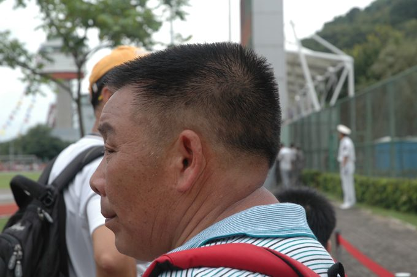

# 发型参考与制作说明

本项目新增发型、服装的默认流程：先确认具体照片或可复用模型，再拆分轮廓、分区和发流；记录来源及许可。没有具体参考的试验形状不得标为已完成的经典预设。转换成 JS 或删除原模型不会改变素材许可。

## v14 男性短发：照片参考重建

这四款是观察真实照片后，在现有 CC0 头部上重建的 JS 网格，并非从照片提取的原始 3D 模型，也不是下载到的 VRoid 短发预设。照片没有显示的角度采用左右对称及现有头部结构补足；当前是一轮重建，需要继续评估实际游戏视角下的效果。

| 预设 | 具体参考 | 实现观察 |
| --- | --- | --- |
| 圆寸 | [Male buzzcut.jpg](https://commons.wikimedia.org/wiki/File:Male_buzzcut.jpg)，Mark S. Kettenhofen，美国海军，1998 | 发长极短，沿头骨轮廓，额前自然弧线、太阳穴退让，保留可见头皮。 |
| 军式短发 | [Crew Cut, Semi Short Taper.jpg](https://commons.wikimedia.org/wiki/File:Crew_Cut,_Semi_Short_Taper.jpg)，美国海军陆战队照片裁切，2011 | 前顶较长并略抬起，后顶收短，太阳穴至耳上渐短；前向发流单独制作。不是将顶部统一拉高。 |
| 方正平头 | [PRC flattop-1.jpg](https://commons.wikimedia.org/wiki/File:PRC_flattop-1.jpg)、[PRC flattop-2.jpg](https://commons.wikimedia.org/wiki/File:PRC_flattop-2.jpg)，SoHome Jacaranda Lilau，2014 | 同一发型的后面和侧面参考；近水平顶面、较方的肩线，枕部收紧，短直立发束。前面未展示，按对称结构补足。 |
| 短碎渐变 | [Fresh and Short French Crop](https://haircutinspiration.com/french-crop-haircut/)，页面中 @tombaxter_hair 的同名照片 | 前向纹理，短且稍不齐的额前切口，上部比两侧长；移除 v13 的波波刘海压缩做法。照片仅供观察，不作为贴图，也不随项目分发。 |

上面的四张仓库内照片均为缩小后的参考副本，分别为 PD-USGov-Military / PD-USGov-Navy 或作者明确释放到 public domain 的文件。详细许可见各来源页面。人物外貌不用于复刻角色，观察对象为剪裁与发流。

## 参数与拆分

实现位于 `dist/hair.js` 的 `shortProfiles`（各款纵向顶面、横向肩线、渐短密度）和 `shortGuides`（分区发流导向）。这些数据是人工观察后的设计比例，不声称是摄影测量值。JS 细分现有头皮并贴合 CC0 头部，按参考曲线调整顶部，发束沿该表面拟合，分成前、侧、后发；长度和蓬松度仍可调，原骨骼、发色及 HSL 设置继续使用。

## 其他候选素材

[Micket 的 Side parting hairstyle](https://opengameart.org/content/side-parting-hairstyle-for-male-model) 是 CC0 的真实短发模型，已检查来源并下载研究文件。本轮没有将它伪称为圆寸、军式短发或平头，也没有接入运行时。以后可作为单独侧分预设的候选。

BOOTH 上的 CC0 very short 候选（item 3748889）当前无法取得源文件，因此未作为已导入的模型记录。
